# Electric Vehicle Battery Sizes and Driving Distance

## Introduction
The reason why I was interested in understanding the battery size/capacity and the range in KM is because I purchased my first electric vehicle in 2023 but did no prior research into batter sizes and what this would mean in terms of drivable distance as a result, I purchased a car, that was excellent to drive, cheap to charge but was unable to do a long distance drive without having to stop multiple times, using expensive public charging locations. Using the knowledge and skills learnt during my Data Science degree, I am now able to analyse data from the EV car market and make a more details and informed choice of what car to purchase next time.

## Data Collection
The data that was used for the analysis of this project was downloaded from Kaggle. The Dataset [Cheapest Electric Cars 2023](https://www.kaggle.com/datasets/kkhandekar/cheapest-electric-cars)

**Pre Clean Dataset**

The data was downloaded in the format that can be seen in the image below. There was excess data in columns that wouldnt be required for this peice of analysis. 

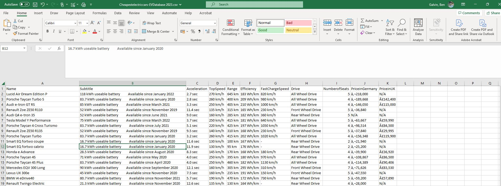

**Columns to be Removed**

The columns highlighted in green would remain in the final clean cut of data. The data in the columns highlighted in Red/Orange would be removed. 

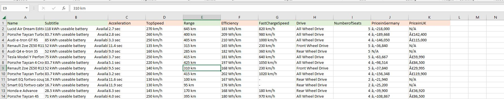

**Missing Data**

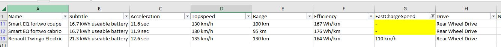

Within one column of data, the fast charging column two rows of data were missing, to ensure the data was complete, the manufacturers website was consulted to obtain the missing information. As the two vehicles do you use fast charging, there will be no data and therefore the information is replaced with dashes.

**Data Manipulation**
The column tiles were manipulated to ensure the information was ready for analysis in Power BI and Excel. 
The following adjustments were made:
- Column titles to be named clearly with units of measurement inside (kWh and kms)
- Data editing to remove the km from the Range km Column as the title had the units of measurements
- Removal of excess characters in column Useable Battery kWh as this would prevent analysis. The excess characters were removed by a LEN function and Find and Replace

The different stages of the manipulation can be found in the below images:
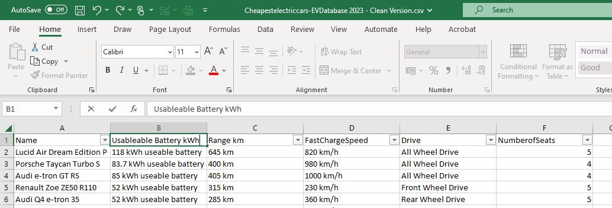

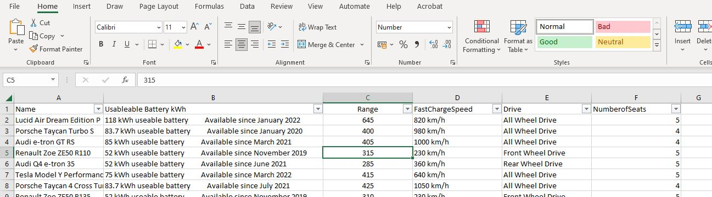

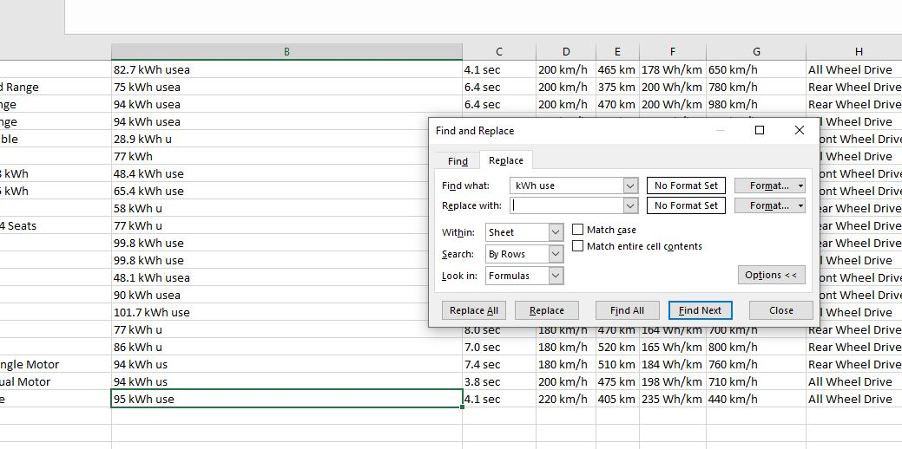

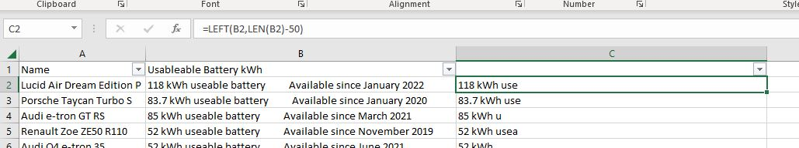

## Data Analysis

**Data Analysis - Excel**

The data from the Usable Battery kWh and Range KM to create the data points for the linear regression. the X Axis will be the Battery Size kWh and the Y Axis will be the Range KM, the below screenshot shows the items being selected for the regression analysis. 

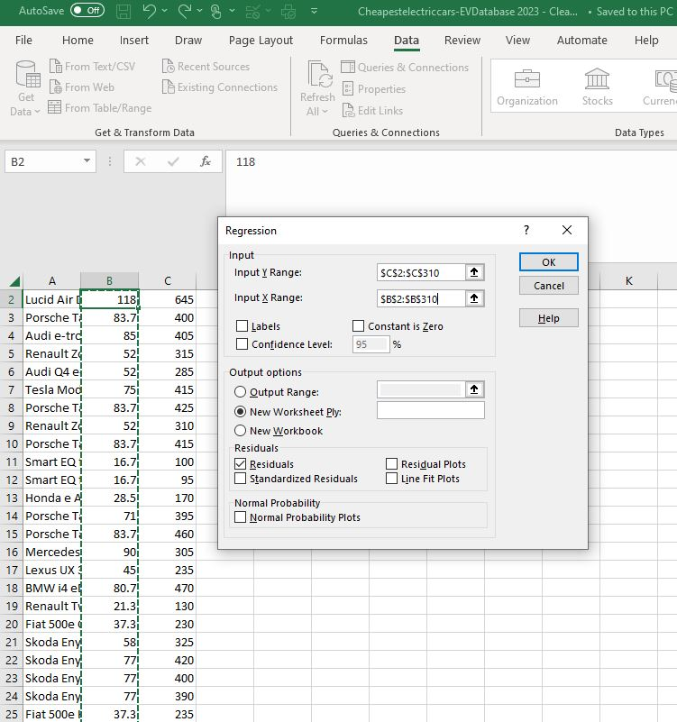

The next step was to format the X & Y axis to ensure they were titled correctly, also had to ensure the legend was labled correctly. A Linear trend line was also added

The results are shownn in the next two screenshots and will be discussed in the results section

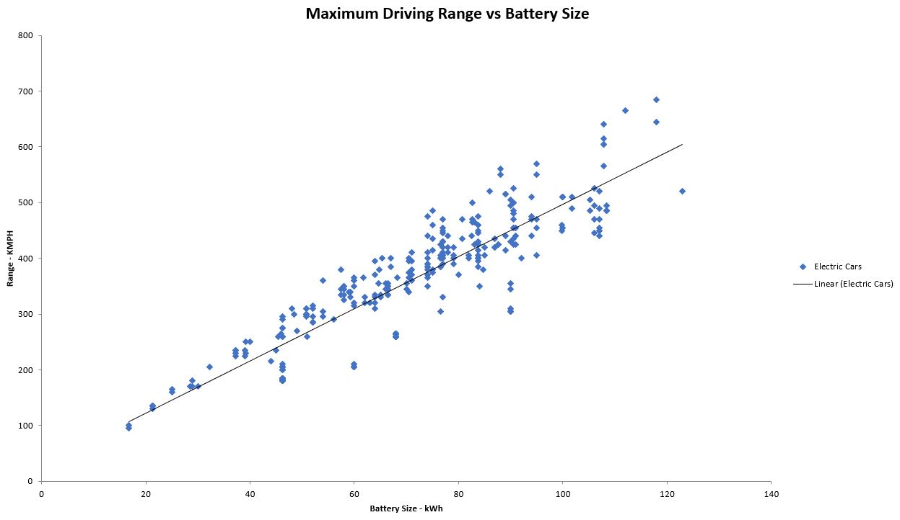 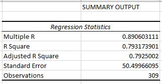

**Data Analysis - Power BI**

The data was also input into Power BI to create some visuals and a small dashboard to give an details of the EV with the highest range in KM and the EV with the shortest range in KM

The data was loaded directly from One Drive using the Excel get data function

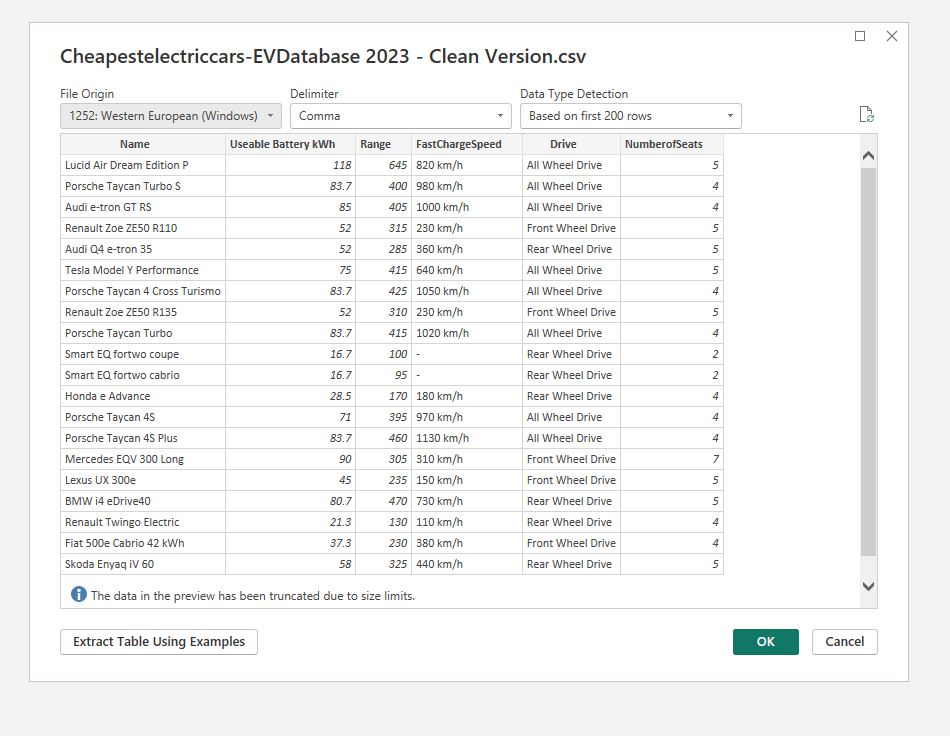 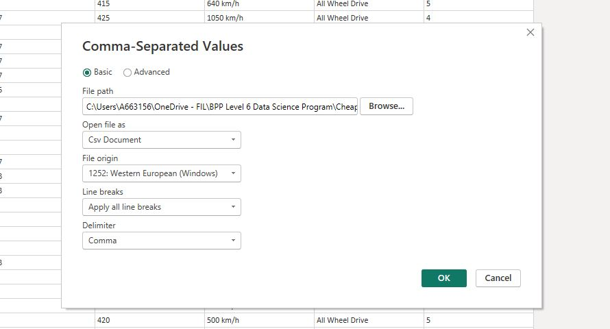

The data was then transformed into the correct data types becuase power BI didnt recognise the data in the Useable Battery kWh column. it was corrected to Decimal Number. The screenshot show the before transformation and after

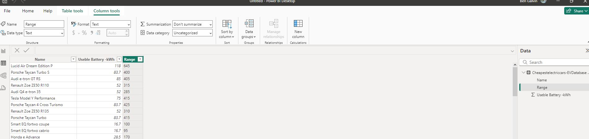 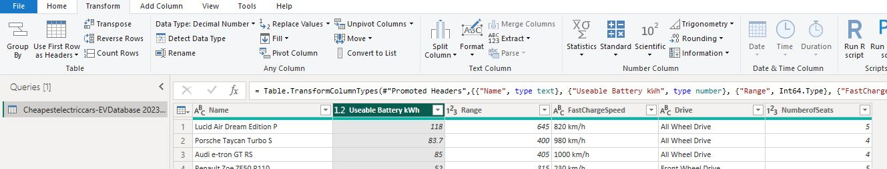 

A scatter plot was created to show the Values of the cars when hovered over in the values column, with the X Axis being the Useable Battery and the Y Axis being the Range KM. 

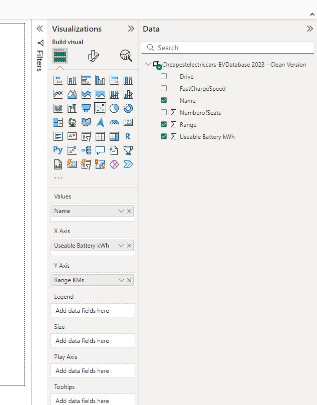

## Results
